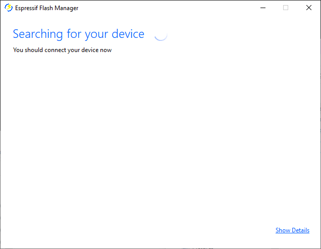

  

<h3 align="center">
  Espressif Flash Manager (N2D22)
</h3>

  
  
  
   
  
  
  

## Getting Started
For a full guide on the tool, see the [Wiki](https://github.com/pseudo8086/n2d/wiki). You can download the latest release [here](https://github.com/pseudo8086/n2d/releases/latest).

## The Final Journey
Wow! It's been a while and the success of this terribly simple (yet somehow not always functional) program over the years has been unprecedented in my opinion; thanks for all of your support and contributions (including people who raised issues) for this project. But as time moves on, so do we. This means that this project won't be receiving mainstream support from me any longer (not that my support very good to begin with) but I will only be making changes when enough issues arise.

Of course, before I suspend work on N2D, it needs to be fully functional the so I've decided to give it the 'oomph' it needs after getting a new rig that can actually run Visual Studio without crashing after 2 hours.

Enjoy!
  

